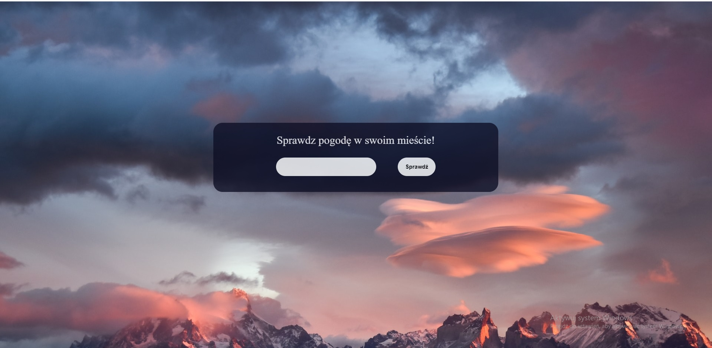
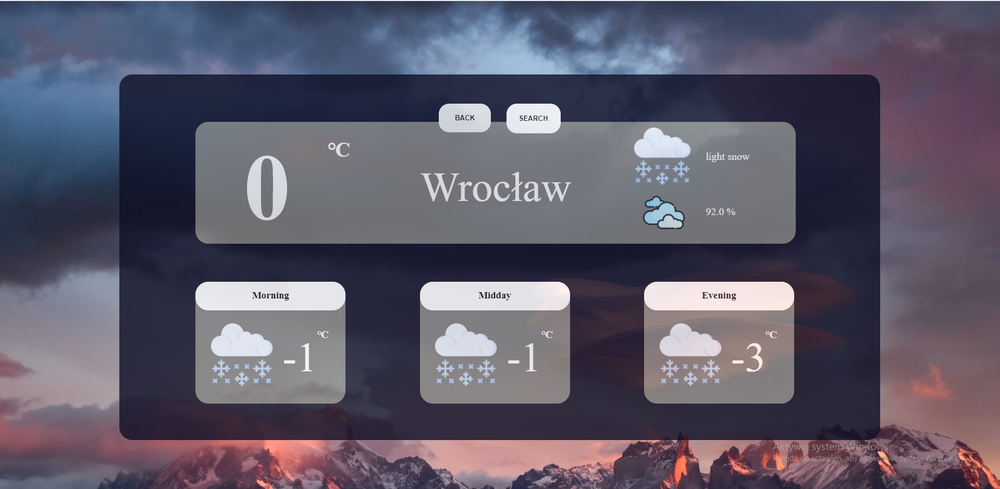

## Informacje
Aplikacja WeatherApp jest aplikacja webową umozliwiającą sprawdzanie pogody w danym miejscu.
Tworząc projekt miałem nacelu naukę obsługi plików JSON i operacji na potrzebnych mi informacjach.

## Technologie
* Java
* Spring
* Css
* Html
* Thymelaf

## Zrzuty ekranów

Strona startowa, umożliwiająca wyszukanie pogody w wybranym mieście.

Strona pokazująca pogodę na 8 najbliższych dni w wyszukanym mieście.

Ekran dostarczający nam szczegółowe informacje na temat pogody danego dnia.

